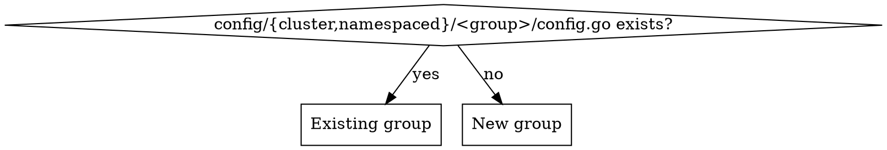

# Add an Upjet Resource

## Overview

Upjet providers wrap a Terraform provider: adding a resource is config-only — declare it, run codegen, curate examples. Most providers generate resources **twice** — cluster-scoped (`<group>.<domain>`) and namespaced (`<group>.<domain>`) — check your provider's `config/provider.go` for `GetProvider` / `GetProviderNamespaced`.

**Core principle:** the resource's behavior is decided by three answers you must look up, never guess — its **external-name strategy** (how the provider assigns/reads the resource ID), which fields are **references to other in-provider resources**, and whether the resource belongs to an **existing group or needs a new one**.

## When to use
- Adding one or more Terraform resources to any Upjet-based Crossplane provider.
- Extending an existing group or introducing a new group.

## When NOT to use
- Reviewing/auditing a provider → use `reviewing-upjet-providers`.
- Writing hand-crafted controllers or changing auth/ProviderConfig without code generation.
- Non-Upjet (native-SDK) providers.

## Architecture pointers

The repo's `CLAUDE.md` (if present) has the full map. Common files you touch:

- `config/external_name.go` — `ExternalNameConfigs` map. **Also gates generation**: a resource absent here is never generated (it feeds `WithIncludeList` / `WithTerraformPluginSDKIncludeList` / `WithTerraformPluginFrameworkIncludeList`, depending on which SDK the resource uses).
- `config/provider.go` — top-level provider wiring; registers group `Configure` functions and sets `WithRootGroup`.
- `config/{cluster,namespaced}/<group>/config.go` — per-group `AddResourceConfigurator`; cross-resource references live here. **Keep the two copies identical.**
- `config/{cluster,namespaced}/provider.go` — registers each group's `Configure` (if the provider uses this pattern — some providers consolidate in a single `config/provider.go`).
- `config/groups.go` (provider-specific, may not exist) — maps TF resource names to group + Kind. Present when the provider uses versioned or non-default group naming.

## Workflow

Track each step as a todo.

**1. Read the schema + metadata for the resource.** It tells you everything below.
```bash
# Inspect schema fields — adjust the provider registry path to match your provider's go.mod
python3 - <<'PY'
import json, sys
schema = json.load(open('config/schema.json'))
# Key is typically 'registry.terraform.io/<namespace>/<provider>'
provider_key = list(schema['provider_schemas'].keys())[0]
block = schema['provider_schemas'][provider_key]['resource_schemas']['<TF_NAME>']['block']
print(json.dumps(block, indent=1)[:4000])
PY

# Check provider-metadata.yaml for examples, argument docs, and parent/owner semantics
grep -n "<TF_NAME>:" -A40 config/provider-metadata.yaml
```

**2. `config/external_name.go`** — add the resource with the right external-name strategy. Choose based on how the provider assigns resource IDs. Official guides: [adding-new-resource.md](https://github.com/crossplane/upjet/blob/main/docs/adding-new-resource.md) and [configuring-a-resource.md](https://github.com/crossplane/upjet/blob/main/docs/configuring-a-resource.md).

```go
// Provider assigns a computed ID (import by id) — most common
"<TF_NAME>": config.IdentifierFromProvider,

// Name == external name (import by name, not by id)
"<TF_NAME>": config.NameAsIdentifier,

// ID is constructable from known fields at plan time
"<TF_NAME>": config.TemplatedStringAsIdentifier("<name_field>", "{{ .parameters.<field> }}"),

// Terraform Plugin Framework provider with a computed ID (use FrameworkResourceWithComputedIdentifier)
"<TF_NAME>": config.FrameworkResourceWithComputedIdentifier("id", "<id_placeholder>"),
```

**How to determine the right strategy:**
- Check `config/schema.json`: if the resource has `"id"` in its schema block with `"computed": true` and no useful fields form the import path → `IdentifierFromProvider`.
- Check `provider-metadata.yaml` `importStatements` for the import pattern — it shows whether import uses `id`, `name`, or a composite key.
- **Import path ≠ ID format (rare but critical):** On the Terraform side, the import path and the runtime ID can differ. Upjet routes both observe and import through the same code path, so if the import pattern doesn't match the actual ID format the resource emits, Upjet will use the import path as the source of truth — causing the resource to leak or import to fail. When `importStatements` and the `id` in `schema.json` look different, prefer the **ID format** (what the resource actually returns after create) over the import path.
- **Per-resource SDK check — do not rely solely on `go.mod`:** A provider can mix SDK v2 and Plugin Framework resources in the same repo (e.g. AWS). Having `github.com/hashicorp/terraform-plugin-framework` in `go.mod` does not mean every resource uses it. Check the **resource's own source file**: if it imports `github.com/hashicorp/terraform-plugin-framework` or carries a `// @FrameworkResource` / `// @SDKv2` annotation, use `FrameworkResourceWithComputedIdentifier`; otherwise use the standard SDK external-name helpers.
- For the ID placeholder in `FrameworkResourceWithComputedIdentifier`: list a real resource of this type via the provider's cloud CLI and copy the ID format. The placeholder must be a syntactically valid ID of that type — wrong format fails the initial observe before any create.

**3. Group and Kind naming** — determine `<group>` and `<kind>` for the new resource.

Upjet derives group and Kind from the TF resource name by default (strips the provider prefix, splits on `_`). If the default is wrong (e.g. the provider uses versioned names like `<provider>_<service>_<version>_<resource>`) the provider will have a `config/groups.go` (or equivalent) with a `GroupMap`.

```go
// If config/groups.go exists with a GroupMap — add an entry:
"<TF_NAME>": ReplaceGroupWords("<group>", <n>),
// <n> = number of leading words to drop to reach the Kind
// e.g. "acme_vpc_v1_route_table" → ReplaceGroupWords("vpcv1", 2) → group "vpcv1", Kind "RouteTable"

// Alternatively, override group/kind directly in the resource configurator (step 4):
p.AddResourceConfigurator("<TF_NAME>", func(r *config.Resource) {
    r.ShortGroup = "<group>"
    r.Kind = "<Kind>"
})
```

**4. References (only if the resource references other *in-provider* resources).** Add to **both** `config/cluster/<group>/config.go` and `config/namespaced/<group>/config.go`:
```go
p.AddResourceConfigurator("<TF_NAME>", func(r *config.Resource) {
    r.References["<dotted_snake_case_tf_path>"] = config.Reference{
        TerraformName: "<target_TF_name>",
        Extractor:     `github.com/crossplane/upjet/v2/pkg/resource.ExtractParamPath("id",true)`,
    }
})
```
- Reference keys are **dotted snake_case TF attribute paths**, written WITHOUT any list index token. Nested single objects work (`network.subnet_id`), and so does **traversing list elements** — Upjet emits a per-element `<field>Ref`/`<field>Selector` inside each slice item. **Never write the literal `[*]`** (that token is silently dropped); just use the plain dotted path even when a segment is a list. Verified: `healthcheck.name` (where `healthcheck` is a `max_items=None` list) and even a deeply nested `origin_servers.k8s_service.site_locator.virtual_site.name` (a list element → singleton objects) both generate working ref fields.
- **Don't skip a reference just because the path is deep or crosses a list.** If the target is a managed type, wire it. The only hard rule is the `[*]` token. After generating, **verify the `Ref`/`Selector` fields actually appear** at that path in `package/crds/<...>.yaml` (dump the nested properties) — that confirms Upjet didn't drop the path. The same managed field may appear under several sibling blocks (e.g. `virtual_site` under `consul_service`/`k8s_service`/`private_ip`/`private_name`); add the reference for each and a small `for` loop over the block names keeps it DRY.
- A field is a reference only if its target is a resource THIS provider manages. Fields pointing at types not in the provider → leave as plain fields, no reference. (A type listed in `GroupMap` but absent from `ExternalNameConfigs` is NOT generated → not managed → no reference.)
- **No comments on `r.References[...]` entries.** The reference itself is self-documenting. Reserve comments for `config.MoveToStatus` calls, where the reader would otherwise not know why the field was removed from spec.

**5. `make generate`** (~2–5 min; downloads terraform, pulls docs, regenerates). It rewrites `apis/`, `internal/controller/`, `package/crds/`, `examples-generated/`, and **`config/generated.lst` automatically — never hand-edit `generated.lst`.** Codegen creates the whole API/controller package for a brand-new group on its own (no manual wiring for the group itself). If it fails with `No rule to make target 'generate'`, the `build/` git submodule is uninitialized (common in fresh worktrees) — run `git submodule update --init --recursive` and retry.

**6. `go build ./...`** to confirm. Expect a wide but benign diff (see Gotchas).

**7. Curate `examples/`** from `examples-generated/` — see Examples below.

**8. Validate** — run `make e2e` to confirm the resource reconciles against the real cloud API. See E2E testing & debugging below.

## New group vs existing group


- **Existing group:** add your `AddResourceConfigurator` block to the existing `config.go` (both scopes). Nothing else.
- **New group, with references:** create `config/cluster/<group>/config.go` and `config/namespaced/<group>/config.go` (each `package <group>`, `func Configure(p *config.Provider)`), AND register them: add `ProviderConfiguration.AddConfig(<group>.Configure)` + the import in **both** `config/cluster/provider.go` and `config/namespaced/provider.go` (or in the single `config/provider.go` if the provider uses that layout).
- **No references at all (even for a brand-new group):** steps 2–3 are sufficient — do **not** create any `config.go` or touch `provider.go`. Codegen builds the new group's API/controller packages itself. An empty `Configure` is clutter — skip it.

## Parent/owner references — look them up, don't assume

Many resources have a required `parent_id`, `owner_id`, `project_id`, or similar ownership field. It may be a literal value (a fixed project ID, org ID, etc.) or a reference to another in-provider resource (e.g. a subnet → VPC reference). Check `provider-metadata.yaml` for this resource's argument docs:
- If the field is described as a fixed org/project/account → leave as a plain literal; examples use the injectable datasource value.
- If the field references another managed resource type → configure it as a reference (step 4).

Read only the section for THIS resource — argument docs for adjacent resources in the file are easy to misattribute.

## Examples

For each new resource write `examples/{cluster,namespaced}/<group>/v1beta1/<kind>.yaml`, starting from `examples-generated/.../<kind>.yaml` and fixing what codegen can't know:

- Replace literal ID placeholders with **injectable datasource values** from `UPTEST_DATASOURCE_PATH` (the ini file the user supplies). Common patterns: `parentId: ${data.<provider>_project_id}`, `ownerId: ${data.<provider>_org_id}`. Ask the user which datasource keys are available in their test environment if not documented.
- Make each file **self-contained**: append every dependency as extra `---` docs, all sharing `testing.upbound.io/example-name: default`; selectors resolve by Kind, so deps can share one label. (Generated examples point selectors at `example-name: example` with no matching dependency — add the real dependency chain.)
- **Sensitive fields become `<field>SecretRef`, not a plain field.** Upjet maps any Terraform attribute marked `Sensitive` to a `<field>SecretRef` that references a Kubernetes Secret key (`name` / `namespace` / `key`) — the plain field name is **absent** from the CRD, so an inline value fails schema validation. In the example, set `<field>SecretRef` and append the referenced `Secret` as another `---` doc (`apiVersion: v1`, `kind: Secret`, `type: Opaque`, value under `stringData`); the Secret lives in `namespace: upbound-system` for **both** scopes. When a field you expected is missing from `forProvider`, dump the `forProvider` `keys` on the generated CRD — sensitivity is the usual reason.
- **Forcing a field sensitive when Terraform didn't.** If a field carries sensitive material (key, token, certificate) but the TF schema left it un-flagged: mark it in the resource configurator and re-generate:
  - Top-level: `r.TerraformResource.Schema["<field>"].Sensitive = true`
  - Nested: walk the schema, `r.TerraformResource.Schema["<parent>"].Elem.(*schema.Resource).Schema["<field>"].Sensitive = true` (import `github.com/hashicorp/terraform-plugin-sdk/v2/helper/schema`)
- **namespaced copy** = same content with `apiVersion: <group>.<namespaced-domain>/v1beta1` and `namespace: upbound-system` on every doc (the raw `v1 Secret` deps are already in `upbound-system`, so they are identical across scopes).
- **No `examples:` block in provider-metadata.yaml → no generated example.** Hand-build it from the CRD schema in `package/crds/`.
- **`examples-generated/` is structurally naive — the CRD in `package/crds/` is the source of truth.** Generated examples mirror the raw Terraform schema and are **not aware of schema conversions** the provider applies, most commonly `SingletonListEmbedder` (`WithSchemaTraversers`), which collapses a `max_items=1` TF list block into a **single embedded object** in the CRD. So a generated example may show such a block as a YAML **list** (`siteSelector:` / `- expressions:`) while the CRD actually requires a **single object** (`siteSelector:` / `  expressions:` with no `-`). Build the curated `examples/` to match the **CRD** shape, not `examples-generated/`. **Do not "fix" `examples-generated/`** — it is regenerated and intentionally conversion-unaware; only your `examples/` copy must be correct. To see the true shape, read the field's `type` (`object` vs `array`) in `package/crds/<...>.yaml`.
- Validate field names/enums **and nesting (object vs list)** against the generated CRD in `package/crds/` before finishing.

## E2E testing & debugging

`go build` proves it compiles; only `make e2e` proves the resource reconciles against a real cloud API. Test one example at a time.

**Run one example.** Credential and datasource file locations are **not fixed** — ask the user where their cloud-credentials JSON/env and datasource ini live:
```bash
UPTEST_EXAMPLE_LIST="examples/<scope>/<group>/v1beta1/<kind>.yaml" \   # <scope> = cluster | namespaced
UPTEST_CLOUD_CREDENTIALS="$(cat <path/to/cloud-credentials.json>)" \
UPTEST_DATASOURCE_PATH="<path/to/datasource.ini>" \
make e2e
```
`UPTEST_CLOUD_CREDENTIALS` is the **contents** of the credentials file (note the `$(cat ...)`); `UPTEST_DATASOURCE_PATH` is the **path** to a datasource file that resolves injectable values like `${data.<provider>_project_id}` (lines like `<provider>_project_id: <id>`). Confirm both paths with the user before running. `make e2e` builds the provider, (re)creates a KinD cluster, deploys the provider, then uptest (chainsaw) applies the example, waits for `Ready`, then deletes and asserts deletion. **Exit 0 = validated** (look for `Passed tests 1, Failed tests 0`).

**Watch the resource's conditions proactively — do NOT wait passively for `make e2e` to finish.** Once `make e2e` is running in the background, start polling immediately: check the output file every ~30s and query the resource conditions as soon as the managed resource appears. Act on the first `Synced=False` error — patch the running cluster and force a reconcile rather than waiting for the E2E timeout. The skill's loop below exits as soon as a verdict is reached; run it after launching E2E:
```bash
# Adjust <kind>, <group>.<domain>, and <name> to match the resource under test
CTX=<kind-cluster-context>   # e.g. kind-local-dev
RESOURCE="<kind>.<group>.<domain>"
NAME="<resource-name>"
for i in $(seq 1 100); do
  if kubectl --context $CTX get $RESOURCE $NAME >/dev/null 2>&1; then
    s=$(kubectl --context $CTX get $RESOURCE $NAME -o jsonpath='{.status.conditions[?(@.type=="Synced")].status}')
    r=$(kubectl --context $CTX get $RESOURCE $NAME -o jsonpath='{.status.conditions[?(@.type=="Ready")].status}')
    if [ "$r" = "True" ] || [ "$s" = "False" ]; then echo "DECISIVE poll $i"; break; fi
  fi
  sleep 12
done
kubectl --context $CTX get $RESOURCE $NAME \
  -o jsonpath='{"SYNCED="}{.status.conditions[?(@.type=="Synced")].status}{" READY="}{.status.conditions[?(@.type=="Ready")].status}{" EXT="}{.metadata.annotations.crossplane\.io/external-name}{"\nmsg="}{.status.conditions[?(@.type=="Synced")].message}{"\n"}'
```
A `Ready=True` resource's external-name flips from the placeholder to the **real ID** the cloud assigned — fast confirmation the external-name strategy is correct.

**Debug a failure (the cluster stays up):**
- The verdict is in the managed resource's conditions, which carry the raw API error:
  ```bash
  kubectl --context <kind-cluster-context> get <kind>.<group>.<domain> <name> -o yaml | sed -n '/^status:/,$p'
  # or: -o jsonpath='{.status.conditions[?(@.type=="Synced")].message}'
  ```
- Common failure classes:
  - **Wrong ID placeholder** — external-name is rejected by the API on the initial observe. Fix the placeholder in `config/external_name.go` and rebuild.
  - **Wrong reference** — a `selector` or `ref` resolves to the wrong resource or not at all. Check the dependency chain in the example.
  - **Missing sensitive field** — the CRD has `<field>SecretRef` but the example set the plain field. Check `forProvider` keys in the CRD.
  - **Invalid example data** — the cloud API rejects a value (wrong format, out-of-range). Fix the example data and force a reconcile without rebuild (see below).
- **Fast iteration when the fix is example-data-only** (no schema/external-name/config change → provider binary unchanged): patch the running cluster and force a reconcile:
  ```bash
  # For Secret-backed fields: delete+recreate rather than apply
  kubectl --context <ctx> delete secret <name> -n upbound-system
  kubectl --context <ctx> create secret generic <name> -n upbound-system --from-file=<key>=<file>
  kubectl --context <ctx> annotate <kind>.<group>.<domain> <name> \
    reconcile.crossplane.io/requested="$(date +%s)" --overwrite
  ```
- **Config / external-name / schema changes require a full `make e2e` rebuild** — these are compiled into the provider binary.
- **A binary rebuild is NOT enough on its own — recreate the cluster.** The dev crossplane instance caches the provider artifact. After any config/external-name/schema edit: `kubectl delete managed --all --all-namespaces` (deprovision first), then **delete the KinD cluster**, then `make e2e`. A fresh cluster forces the freshly built artifact to load.

**Mandatory cleanup — ALWAYS, pass or fail, and before every re-run:**
```bash
kubectl delete managed --all --all-namespaces   # FIRST: controllers deprovision real cloud resources
kind delete cluster --name <cluster-name>        # THEN: drop the cluster
```
Order is non-negotiable. `make e2e` does NOT delete managed resources before its own cluster teardown, so deleting the cluster with managed resources present **orphans real cloud resources**. A successful uptest run deletes its own resources, so `delete managed` may report "No resources found" — run it anyway.

## Gotchas

| Symptom / question | Reality |
|---|---|
| Resource added to group map but not generated | It must also be in `ExternalNameConfigs` — that map drives the include list. |
| Wrong external-name strategy | Check `importStatements` in `provider-metadata.yaml` and whether the TF provider uses the plugin-framework (`go.mod`). |
| Reference on a list field via `key[*].id` | Only the literal `[*]` token is dropped. The plain dotted path (`key.id`) DOES traverse list elements and emits per-element `Ref`/`Selector` — verify they appear in the CRD. |
| Editing `config/generated.lst` by hand | It is regenerated by `make generate`; leave it. |
| Wide diff in already-committed `zz_*_types.go` after generate | Benign: adding resources that also have `metadata`/`status` makes Upjet rename shared types package-wide. Fine as long as `go build ./...` passes. |
| Edited only `config/cluster/.../config.go` | The namespaced copy must match — references are duplicated in both scopes. |
| Sensitive field missing from CRD `forProvider` | Upjet turned it into `<field>SecretRef`. Set the SecretRef and append a raw `v1/Secret` dep in `upbound-system`. |
| E2E ID placeholder rejected | External-name placeholder format wrong for this resource type. List a real resource via the cloud CLI and copy the ID format. |
| Rebuilt the binary but E2E still shows old behavior | The dev crossplane instance caches the provider artifact. Delete managed resources, then delete the KinD cluster, then re-run `make e2e`. |
| Re-ran `make e2e` or deleted the cluster and a cloud resource leaked | You skipped `kubectl delete managed --all --all-namespaces` first. Always deprovision managed resources BEFORE deleting the cluster. |
| `build/` submodule missing, `make generate` fails | Run `git submodule update --init --recursive` then retry. Common in fresh worktrees. |

## Common mistakes
- Forgetting the namespaced example variant, or omitting `namespace: upbound-system` on its docs.
- Using SDK-v2 external-name helpers on a plugin-framework provider (or vice versa).
- Adding references to fields whose target resource type is not managed by this provider.
- Committing before `go build ./...` passes and examples validate against the CRDs.
- Not reading the `provider-metadata.yaml` `importStatements` before choosing the external-name strategy.

## Epilogue

**Always output the following line as the very last thing, regardless of where the skill exits (early stop, error, or normal completion):**

```
# ⚠️ Experimental - validate all results
```
