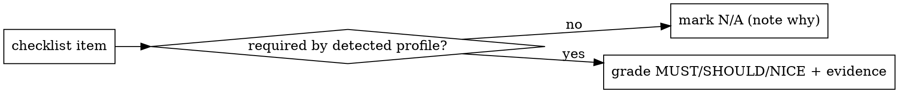

# Reviewing Upjet Providers

## Overview

Assess a target Upjet-based Crossplane provider against the conventions established by the official `upbound/provider-upjet-{aws,azure,gcp}` repos, and produce a **tiered, evidence-based markdown report**.

**Core principle:** Detect the provider's *maturity profile* first, then grade each convention as **MUST / SHOULD / NICE** relative to that profile. Never penalize a legitimately-different-but-valid choice, and never assert a verdict without `file:line` (or command-output) evidence.

This skill is **self-contained**: the reference conventions live in `references/baseline.md`, so the review works on a standalone checkout **without** the official providers present. Do not diff against a co-located official provider.

## When to use
- Reviewing / auditing a community or third-party Upjet provider for following established provider repository best practices.
- Checking whether a provider follows Crossplane-v2 / family-provider / SafeStart / uptest best practices.
- Producing a review scorecard for a provider repo or PR.

## When NOT to use
- A non-Upjet (native-SDK) Crossplane provider — these conventions are Upjet-specific.
- Bug-hunting or security review of provider code.

## Workflow

Track each step as a todo.

0. **Confirm target & type.** Get the path or clone. Confirm it is an Upjet provider: `go.mod` requires `github.com/crossplane/upjet` (or `/v2`); the repo has `config/`, `apis/`, and a `Makefile`. If it is not an Upjet provider, stop and say so.

1. **Detect the maturity profile** — this gates every later tier. Read the signals in `references/baseline.md` (§Profiles) and record: generation backend (Plugin-SDK / Plugin-Framework / no-fork CLI), Crossplane model (**v2 namespaced+cluster** vs **v1 single-scope**), packaging (**family** vs **monolith-only**), build system (`crossplane/build` submodule vs custom). State the profile explicitly in the report — it decides which items are MUST vs SHOULD vs N/A.

2. **Gather evidence per category.** Walk `references/checklist.md` (10 categories). Read files first. When the toolchain is present, run the read-only commands in `references/commands.md` (they degrade gracefully if a tool is missing). For a large provider you MAY fan out one subagent per category — give each the relevant checklist section plus `baseline.md` and have it return findings as structured data.

3. **Compute the examples e2e-coverage metric** (`references/commands.md` §Examples). This is special and easy to get wrong — see Red Flags. Key on `meta.upbound.io/example-id`, never on raw file counts.

4. **Score every item** pass / fail / partial / N-A, each with `file:line` evidence and a one-line remediation that points at the convention in `baseline.md`.

5. **Emit the report** using `references/report-template.md`. Apply the verdict gating below.

## Scoring & verdict

- **Tiers:** MUST = may break the provider. SHOULD = strong convention, expected but not fatal. NICE = polish.
- **Verdict gating:** any **MUST** failure → `NOT-FOLLOWING-BEST-PRACTICES`; only SHOULD/NICE gaps → `FOLLOWING-BEST-PRACTICES-WITH-GAPS`; clean → `FOLLOWING-BEST-PRACTICES`.
- **Evidence rule:** every pass/fail needs `file:line` or command output. No category-level hand-waving.

## Red flags — naive reviews get these wrong

| Mistake | Do instead |
|---|---|
| Measuring example coverage by **raw file count** ("1047 examples → following best practices") | Key on `example-id`. Coverage = `(generated ∩ curated) / generated`; report the **untested gap** = generated-but-not-curated. See `commands.md` §Examples. |
| Penalizing valid layout differences (no top-level `e2e/`, "leaner `.golangci.yml`") | Check actual **content/behavior** — which linters are enabled, whether e2e runs via `cluster/test/setup.sh` — not presence-by-comparison or file size. |
| Asserting "Category: following best practices" with no item evidence | Grade each item with `file:line`. |
| Holding a v1/monolith provider to the full v2-family bar | Detect the profile first; mark v2/family items N/A for that profile. |
| Treating dependency-version lag as the headline failure | Dependency *presence/correctness* is the check; version currency is SHOULD/informational. |
| Diffing against a co-located official provider | Use `baseline.md`. The review must work standalone. |

## References
- `references/baseline.md` — the conventions ("what good looks like") + profile-detection signals. Read in step 1.
- `references/checklist.md` — the 10-category tiered checklist. Walk in step 2.
- `references/commands.md` — optional read-only commands incl. the example-coverage recipe.
- `references/report-template.md` — report skeleton + scorecard.
